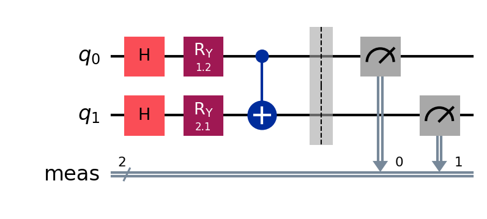

#  Hybrid Quantum Machine Learning Demo

This project demonstrates a simple **Hybrid Quantum-Classical Machine Learning model** using Qiskit and Scikit-learn.

##  Concept
We combine:
- Quantum feature encoding using Qiskit circuits
- Classical ML model (Logistic Regression)

This is a basic example of:
Quantum Machine Learning (QML)

##  Tech Stac
- Qiskit
- Qiskit Aer
- NumPy
- Scikit-learn

##  How to run

```bash
pip install -r requirements.txt
python hybrid.py

```
##  Quantum Feature Encoding
```
We use **Angle Encoding** to transform classical data into quantum states.

Each input feature is mapped to rotation angles applied on qubits using Ry gates.

Additionally, we introduce entanglement using CX gates to capture correlations between features.

This allows the quantum circuit to represent classical data in a higher-dimensional Hilbert space, which can enhance feature separability in some cases.
```
---

## Output
The model predicts simple XOR-like patterns using quantum-enhanced features.
---
##  Quantum Circuit



This circuit represents a simple Hybrid Quantum-Classical feature encoding pipeline built using Qiskit.

It includes:

Angle Encoding (Ry gates):
Classical input features are converted into quantum rotation angles.
Superposition (Hadamard gates):
Prepares qubits to explore multiple states simultaneously.
Entanglement (CX gate):
Captures correlations between input features.
Measurement:
Converts quantum states back into classical information for machine learning models.

This structure is a basic example of Quantum machine learning, where quantum circuits are used as feature transformation layers in a classical ML pipeline.

## Note
This is an educational/demo project, not a production quantum advantage model.

---

#  4. .gitignore

```gitignore id="git1"
__pycache__/
*.pyc
quantum_env/
.env
